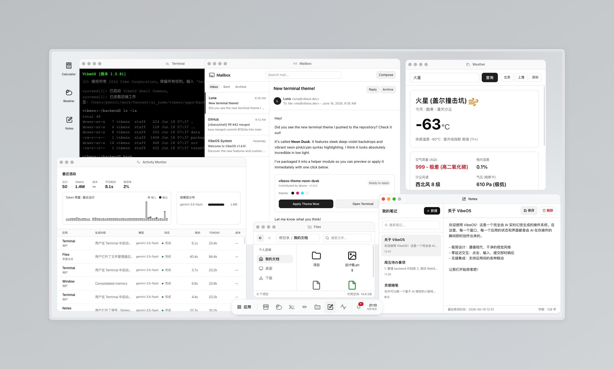

# VibeOS

**English** · [简体中文](./README_CN.md)

An **AI-hallucination-driven operating system** in the browser. Except for the
core runtime, every window's interface is generated in real time by AI: the user
acts on a window, and the system asks the model what the window should become
next — as if it were a real program responding.



> **A reproduction of the Microsoft Build 2026 "Vibe OS" demo.**
> VibeOS is a from-scratch fan reproduction of the concept shown in the
> **Microsoft Build 2026 Vibe OS** demo. Full credit and many thanks to that demo
> for the inspiration — this project exists because of it.

> The OS is real (kernel, windows, persistence, agents, context menus). The
> *contents* are hallucinated.

## Features

- **AI dynamic UI** — app windows are HTML fragments generated/patched live by the
  model. UI generation is **stateless**: every action sends the full current UI as
  context, so any app re-renders correctly without relying on a growing chat session.
- **Skins / theme system** — switch the whole OS look live in Settings: **DevDock**
  (the native minimal theme), **Windows XP "Luna"**, and **Mac OS X "Aqua"**. Skins
  are pure CSS over design tokens, so the OS chrome *and* the AI-generated content
  both re-skin instantly — independent of light/dark.
- **AI Skin Studio** — the native **Skins** app manages custom skins with a dropdown
  and a prompt conversation. Create a blank skin from VibeOS primitives, or duplicate
  any skin's current appearance. Built-ins stay read-only. Generation continues when
  its window/browser closes; each successful result saves and immediately applies a
  new version. Pick an older version to restore it and continue designing from there.
  Failed/cancelled requests preserve the active version; backend restarts mark in-flight
  requests interrupted and retain the prompt for retry. No external theme framework:
  AI uses our [token and chrome contract](packages/shared/src/domain/skins.ts), with a
  design pass followed by a craft review. The selected version's original brief stays
  in context. Skins can define chrome proportions, layered materials and generated
  wallpaper/texture/frame images using the configured image model. Images must finish
  before publication; failed image generation preserves the active version.
  Skin files are stored under `~/.vibeos/disk/System/Skins/`; conversation, progress and
  version indexes are in the runtime database. Generated images are reused from
  `disk/Medias/Images/` across versions and copies. Deletion archives skin definitions
  in Trash and retains shared images. A skin's desktop background takes precedence
  while selected; switching away restores the user's wallpaper. The Import/Export
  menu exports the selected appearance and embedded images as a `.vibeskin` file to
  Desktop. Import via Skins or open the package in Files to create an independent,
  editable skin; conversations and version history are not included in the package.

- **OS context menus** — right-click anywhere. Menus differ by location (desktop,
  window title bar, app content, taskbar, taskbar item), submenus follow the
  "safety triangle" aim, and the styling follows the active skin.
- **Activity Monitor** — a live dashboard of every AI run: token-usage chart
  (input vs output), by-model distribution, cost, latency, error rate, and a
  scroll-paginated run log.
- **App Store & freezing** — install template apps, **freeze** a window's current
  state into a reusable app, and export / import apps as `.vibeapp` JSON.
- **Native Files** — browse and edit the real system disk, import/download files,
  rename/move/copy folders and files, and restore items from Trash. No model is involved.
- **Native viewers** — double-click files to open separate Text Viewer or Media Viewer
  windows. Text stays literal; images support fit/actual size, audio/video use browser
  playback controls. Open file paths survive refreshes and restarts.
- **Persistent system state** — windows, app memory, desktop references, settings,
  notifications, the user profile and agent runs live in SQLite and survive restarts.
- **Multi-agent runtime** — several agents drive the system concurrently:
  - **UI-Generation Agent** (strong model) — renders/patches windows on user actions.
  - **System-Event Agent** (fast model, on a timer) — invents ambient notifications so
    the OS feels alive, without being user-triggered.
  - **Maintenance Agent** (fastest model) — consolidates per-window memory, prunes logs.
- **Desktop shell** — desktop, draggable/resizable multi-window manager, taskbar,
  start menu (split into *system* and *generated* apps), notifications (toasts + center).
- **Global user profile** — a profile/memory the user writes once; every generated app
  reads it so the OS feels personalized and coherent across windows.
- **System calls** — the model can emit `notify`, `open`, `spawn-window`, `install`
  (virtual app + desktop shortcut), `create-file`, `focus` and `close` calls.
- **Sandboxed rendering** — AI HTML is sanitized (no scripts / inline handlers); all
  interaction is captured by event delegation and routed back as operations — including
  the values typed into inputs, so submits carry their content.
- **Pluggable AI backends** — the model layer sits behind one `AiProvider` seam, so the
  OS runs on **CodeBuddy**, **Claude Code**, or **Codex** (local CLIs) or **OpenRouter**
  / any OpenAI-compatible API (via the Vercel AI SDK). Switchable live in Settings.
- **Bilingual (zh / en)** — all native UI *and* AI-generated content follow the chosen
  language; the locale is injected into every generation prompt.

## Tech stack

Bun (runtime + package manager) · Vite 8 · React 19 · Tailwind CSS 4 · Zustand ·
`bun:sqlite` · [`motion`](https://motion.dev) · Phosphor (app icons) + lucide (chrome).

The UI is built on a **custom, token-based design system** (oklch CSS variables,
Geist + JetBrains Mono). The skin system layers alternate visual languages
(XP / Aqua) over those same tokens via `data-skin` on `<html>`.

AI backends use **no vendor SDKs for the CLIs**: `claude` / `codebuddy` are driven in
headless stream-json mode (`-p --output-format stream-json`) and `codex` via
`codex exec --json`. **OpenRouter** (and any OpenAI-compatible API) goes through
[`ai`](https://www.npmjs.com/package/ai) + `@ai-sdk/openai-compatible`.

## Architecture

The CLI-based providers (CodeBuddy / Claude Code / Codex) each spawn a CLI subprocess,
so the AI layer runs **backend-only**. VibeOS is therefore a Bun backend (HTTP +
WebSocket) that drives the providers and the agent scheduler, plus a Vite/React frontend
that connects over one WebSocket. SQLite owns runtime state; the system disk owns
file contents. Frontend stores mirror backend state.

All model access funnels through a single `AiProvider` seam (`apps/backend/src/ai/providers/`),
so agents, the prompt assembler, and the frontend never know which backend is active. CLI
providers stream over `providers/cli/` (subprocess + JSONL); OpenRouter is an HTTP provider.

```
packages/shared   protocol + domain types shared by both sides
apps/backend      Bun server: kernel/boot, SDK manager, model policy, prompt
                  assembler, agent scheduler, syscall interpreter, sqlite repos
apps/frontend     React desktop shell: window manager, taskbar, start menu,
                  AI-HTML surface, context menus, skins, notifications, settings
```

## Getting started

Requires **Bun**. For real AI, the active provider's backend must be reachable: the
matching CLI on PATH and authenticated (`codebuddy` / `claude` / `codex`), or an
`OPENROUTER_API_KEY` for `openrouter`.

```bash
bun install
bun run dev        # starts backend (:7720) + frontend (:7730)
```

Open http://localhost:7730.

### Offline / stub mode

To run the whole OS without the model (deterministic stub UI):

```bash
VIBEOS_AI_STUB=1 bun run dev
```

### Environment

Copy `.env.example`. Notable variables:

| Variable | Purpose |
|---|---|
| `PORT` | backend port (default 7720) |
| `VIBEOS_DATA_DIR` | Data root (default `~/.vibeos`): `runtime/` for internal state, `disk/` for the system disk |
| `VIBEOS_DB_PATH` | Optional explicit SQLite path; overrides database location; storage-format upgrades still run |
| `VIBEOS_AI_PROVIDER` | boot default backend: `claude` (default) `codex` `codebuddy` `openrouter`; unavailable CLIs are skipped |
| `OPENROUTER_API_KEY` | API key for the `openrouter` provider (or `VIBEOS_AI_API_KEY`) |
| `VIBEOS_AI_BASE_URL` | OpenAI-compatible endpoint for `openrouter` (default OpenRouter) |
| `VIBEOS_AI_STUB=1` | use stub responses instead of any provider |
| `VIBEOS_AGENTS_DISABLED=1` | disable timer agents |
| `VIBEOS_SNAPSHOT_BUDGET` | cap the current-UI HTML sent as context (0 = no cap) |
| `VIBEOS_MODEL_UI` / `VIBEOS_MODEL_FAST` | override discovered model ids |

The active provider, the **skin**, and the UI/content **language (zh / en)** are also
switchable live in the **Settings** app.

## Scripts

```bash
bun run dev          # backend + frontend
bun run dev:backend  # backend only
bun run dev:frontend # frontend only
bun run build        # production frontend build → apps/frontend/dist
bun run typecheck    # typecheck all packages
bun test             # run the test suite
```

## Persistence

The data root defaults to `~/.vibeos`, independently of the working directory:

```text
~/.vibeos/
  runtime/vibeos.db       # settings, window state, indexes, interactions and logs
  runtime/backups/        # the original database and disk before migration
  disk/
    System/               # storage version and built-in app packages
    Desktop/              # desktop files and .vibelink app shortcuts
    Documents/            # user documents
    Medias/Images/        # generated image files (existing image URLs still work)
    Applications/         # installed apps and generated windows, including closed ones
    Trash/                # reversible deletion with original paths
    Cache/                # temporary generation files
```

App packages contain `app.json` and an optional `index.html`; per-window HTML is
stored alongside the owning app. SQLite holds references to these files, and all
subsequent app saves, snapshots and generated images read/write the disk.

Generating a window archives its current HTML, but does not install a reusable app.
**Save as app** creates a new installed app from that window's current HTML and size,
plus a desktop shortcut. The original window stays independent; later interactions
do not rewrite the saved starting page. `.vibeapp` is a JSON export/import format
for the app manifest and saved starting HTML, not the on-disk package format or a
full backup: linked files, image payloads and window history are not bundled.

Desktop app icons are real `.vibelink` files referencing installed app IDs.
App Store can create a shortcut; installation and saving also create one. Renaming,
moving, deleting and restoring it in Files updates the desktop. Deleting a shortcut
does not uninstall its app. `.vibelink` files only work where the target app is installed.

Before changing an old installation, startup makes a consistent database backup
(including committed WAL data) and copies any existing disk and legacy cache into
`runtime/backups/<timestamp>/`. It then upgrades the schema, exports app definitions,
all window snapshots, images and virtual files, verifies the output, clears the
legacy payload columns, and records storage version 1. Storage version 2 migrates old
desktop and recycled shortcut records into `.vibelink` files while retaining positions,
target apps and deletion state, including installations already on version 1.
This also upgrades installations
partly exported by the earlier native Files implementation. A failed migration stops
startup without marking completion; retries reuse identical output without overwriting
conflicting files. The backup remains available after a successful upgrade.

Files supports UTF-8 editing (up to 2 MB), browser imports (up to 16 MB), streamed
downloads, rename/move/copy, and reversible deletion. Larger files can be placed
directly in `disk/`; external changes refresh open Files windows automatically.
The address bar supports back/forward history, parent navigation, breadcrumbs,
editable paths, path suggestions, relative paths, copy and refresh. Use Ctrl/⌘L
to edit the path, Alt+Left/Right/Up to navigate, and F5 to refresh the focused Files window.
The backend binds to loopback by default. For an explicit remote/reverse-proxy setup,
configure `VIBEOS_HOST` and `VIBEOS_WEB_ORIGIN` for the intended frontend origin.

When the new database is absent, startup detects a legacy `apps/backend/data/vibeos.db`
or `data/vibeos.db`, makes a consistent SQLite copy (including committed WAL data),
and retains the original. It never overwrites an existing target and refuses to guess
between multiple valid legacy databases. Set `VIBEOS_DB_PATH` explicitly to select
an installation without relocating its database. The storage-format migration still
runs for that database; an existing target is also checked for an old storage version.

The kernel then migrates the schema, records the boot, restores open windows and
snapshots, and replays them via `s2c.boot.state`. Search results carry preferred window
sizes; first generation can refine them, and saving an app preserves its actual size.
Smaller screens constrain the displayed window while retaining its preferred geometry.

## Acknowledgements

VibeOS is an independent, unofficial reproduction inspired entirely by the
**Microsoft Build 2026 Vibe OS** demo. It is not affiliated with or endorsed by
Microsoft; all trademarks belong to their respective owners.

## License

[MIT](./LICENSE).
