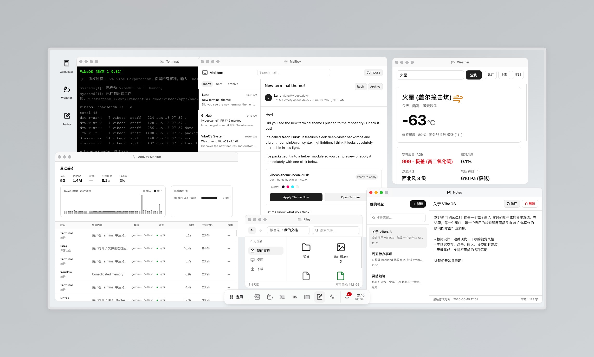

# VibeOS

[English](./README.md) · **简体中文**

一个运行在浏览器里的 **AI 幻觉驱动操作系统**。除了核心运行时之外，每个窗口的界面
都是由 AI 实时生成的：用户在窗口上操作，系统便向模型询问“这个窗口接下来应该变成
什么样”——就像一个真实的程序在响应你。



> **本项目是对 Microsoft Build 2026「Vibe OS」演示的复刻。**
> VibeOS 完全从零复刻了 **Microsoft Build 2026 Vibe OS** 演示所展示的概念。
> 全部灵感来自该演示，在此致以诚挚的感谢——没有它就没有这个项目。

> 操作系统本身是真实的（内核、窗口、持久化、智能体、右键菜单），
> 而其中的 *内容* 是被“幻觉”出来的。

## 功能特性

- **AI 动态界面** —— 应用窗口是由模型实时生成 / 增量打补丁的 HTML 片段。界面生成是
  **无状态的**：每次操作都会把当前完整界面作为上下文发送，因此任何应用都能正确
  重新渲染，而不依赖一个不断增长的会话。
- **皮肤 / 主题系统** —— 在设置里实时切换整机外观：**默认（DevDock，原生极简主题）**、
  **Windows XP「Luna」** 和 **Mac OS X「Aqua」**。皮肤是基于设计令牌（design token）的
  纯 CSS，所以系统外壳 *和* AI 生成的内容会同时即时换肤——并且与明暗模式相互独立。
- **系统级右键菜单** —— 在任意位置右键。不同位置（桌面、窗口标题栏、应用内容、任务栏、
  任务栏项）有不同的菜单，二级菜单遵循“安全三角”的指向判定，样式也跟随当前皮肤。
- **活动监视器** —— 每一次 AI 运行的实时仪表盘：Token 用量图表（输入 vs 输出）、
  按模型分布、成本、耗时、错误率，以及一份滚动分页加载的运行日志。
- **应用市场与固化** —— 安装模板应用，把一个窗口的当前状态 **固化** 成可复用的应用，
  并以 `.vibeapp` JSON 格式导出 / 导入应用。
- **持久化的系统状态** —— 窗口、应用记忆、虚拟文件系统、设置、通知、用户画像和智能体
  运行记录都存放在 SQLite 中，重启后依然保留。
- **多智能体运行时** —— 多个智能体并发驱动整个系统：
  - **界面生成智能体**（强模型）—— 在用户操作时渲染 / 增量更新窗口。
  - **系统事件智能体**（快模型，定时触发）—— 自发产生氛围式通知，让系统“活”起来，
    无需用户触发。
  - **维护智能体**（最快模型）—— 整理每个窗口的记忆、清理日志。
- **桌面外壳** —— 桌面、可拖拽 / 可缩放的多窗口管理器、任务栏、开始菜单
  （区分 *系统* 应用与 *生成* 应用）、通知（吐司 + 通知中心）。
- **全局用户画像** —— 用户只需写一次的画像 / 记忆；每个生成的应用都会读取它，
  让整个系统更懂你、并在窗口之间保持连贯。
- **系统调用** —— 模型可以发出 `notify`、`open`、`spawn-window`、`install`
  （虚拟应用 + 桌面快捷方式）、`create-file`、`focus`、`close` 等调用。
- **沙箱化渲染** —— AI 生成的 HTML 会被净化（无脚本 / 无内联事件处理器）；所有交互
  通过事件委托捕获并作为操作回传——包括输入框里输入的值，因此提交时会带上其内容。
- **可插拔的 AI 后端** —— 模型层位于统一的 `AiProvider` 抽象之后，因此系统可以运行在
  **CodeBuddy**、**Claude Code** 或 **Codex**（本地 CLI），也可以运行在 **OpenRouter** /
  任意 OpenAI 兼容 API 之上（通过 Vercel AI SDK）。可在设置里实时切换。
- **双语（中文 / 英文）** —— 所有原生界面 *以及* AI 生成的内容都会跟随所选语言；
  语言会被注入到每一次生成的提示词中。

## 技术栈

Bun（运行时 + 包管理器）· Vite 8 · React 19 · Tailwind CSS 4 · Zustand ·
`bun:sqlite` · [`motion`](https://motion.dev) · Phosphor（应用图标）+ lucide（外壳图标）。

界面构建在一套 **自研的、基于令牌的设计系统** 之上（oklch CSS 变量、Geist + JetBrains
Mono）。皮肤系统通过 `<html>` 上的 `data-skin`，在同一套令牌之上叠加不同的视觉语言
（XP / Aqua）。

AI 后端 **对 CLI 不使用任何厂商 SDK**：`claude` / `codebuddy` 以无头 stream-json 模式驱动
（`-p --output-format stream-json`），`codex` 通过 `codex exec --json` 驱动。**OpenRouter**
（以及任意 OpenAI 兼容 API）则通过 [`ai`](https://www.npmjs.com/package/ai) +
`@ai-sdk/openai-compatible`。

## 架构

基于 CLI 的提供方（CodeBuddy / Claude Code / Codex）各自会拉起一个 CLI 子进程，因此 AI
层 **只在后端运行**。所以 VibeOS 是一个 Bun 后端（HTTP + WebSocket），负责驱动各提供方与
智能体调度器；再加上一个 Vite/React 前端，通过单条 WebSocket 连接。SQLite 是唯一的事实
来源；前端的 Zustand store 只是它的镜像。

所有模型访问都汇聚到单一的 `AiProvider` 抽象（`apps/backend/src/ai/providers/`），因此
智能体、提示词组装器和前端都无需知道当前激活的是哪个后端。CLI 提供方通过 `providers/cli/`
（子进程 + JSONL）流式输出；OpenRouter 则是一个 HTTP 提供方。

```
packages/shared   两端共享的协议 + 领域类型
apps/backend      Bun 服务端：内核/启动、SDK 管理器、模型策略、提示词组装器、
                  智能体调度器、系统调用解释器、sqlite 仓储
apps/frontend     React 桌面外壳：窗口管理器、任务栏、开始菜单、
                  AI-HTML 渲染面、右键菜单、皮肤、通知、设置
```

## 快速开始

需要 **Bun**。若要使用真实 AI，当前激活的提供方后端必须可达：对应的 CLI 在 PATH 中且已
登录（`codebuddy` / `claude` / `codex`），或为 `openrouter` 提供 `OPENROUTER_API_KEY`。

```bash
bun install
bun run dev        # 同时启动后端 (:7720) + 前端 (:7730)
```

打开 http://localhost:7730。

### 离线 / stub 模式

无需任何模型即可运行整个系统（确定性的 stub 界面）：

```bash
VIBEOS_AI_STUB=1 bun run dev
```

### 环境变量

复制 `.env.example`。常用变量：

| 变量 | 作用 |
|---|---|
| `PORT` | 后端端口（默认 7720） |
| `VIBEOS_DB_PATH` | SQLite 文件（默认 `./data/vibeos.db`） |
| `VIBEOS_AI_PROVIDER` | 启动默认后端：`claude`（默认）`codex` `codebuddy` `openrouter`；未安装的 CLI 会被跳过 |
| `OPENROUTER_API_KEY` | `openrouter` 提供方的 API Key（或 `VIBEOS_AI_API_KEY`） |
| `VIBEOS_AI_BASE_URL` | `openrouter` 的 OpenAI 兼容端点（默认 OpenRouter） |
| `VIBEOS_AI_STUB=1` | 使用 stub 响应而非任何提供方 |
| `VIBEOS_AGENTS_DISABLED=1` | 关闭定时智能体 |
| `VIBEOS_SNAPSHOT_BUDGET` | 限制作为上下文发送的当前界面 HTML 大小（0 = 不限制） |
| `VIBEOS_MODEL_UI` / `VIBEOS_MODEL_FAST` | 覆盖自动发现的模型 id |

当前提供方、**皮肤** 以及界面/内容的 **语言（中文 / 英文）** 也都可以在 **设置** 应用里
实时切换。

## 脚本

```bash
bun run dev          # 后端 + 前端
bun run dev:backend  # 仅后端
bun run dev:frontend # 仅前端
bun run build        # 生产环境前端构建 → apps/frontend/dist
bun run typecheck    # 对所有 package 做类型检查
bun test             # 运行测试套件
```

## 持久化

状态保存在 SQLite 中（`VIBEOS_DB_PATH`）。启动时内核会迁移数据库结构、记录本次启动、
恢复打开的窗口及其快照，并通过 `s2c.boot.state` 回放给客户端。删除该数据库文件即可
重置这台“机器”。

## 致谢

VibeOS 是一个独立的、非官方的复刻项目，灵感完全来自 **Microsoft Build 2026 Vibe OS**
演示。本项目与 Microsoft 无任何隶属或背书关系；所有商标归各自所有者所有。

## 许可协议

[MIT](./LICENSE)。
